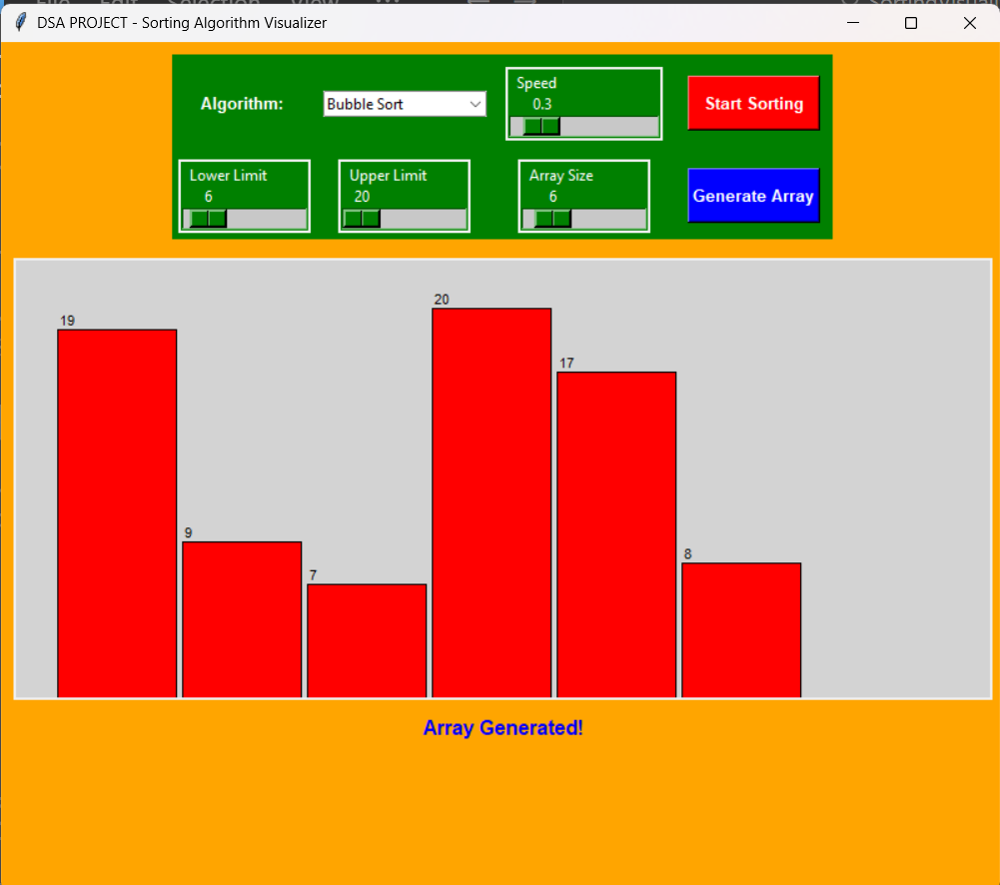
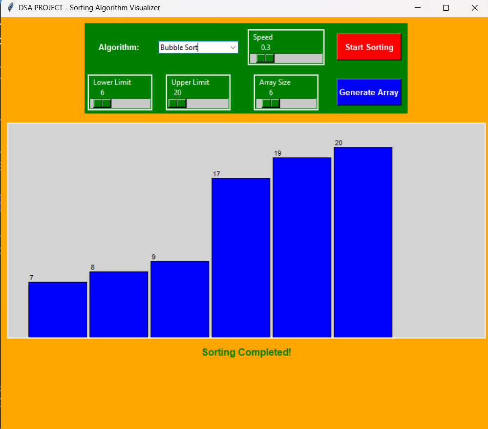
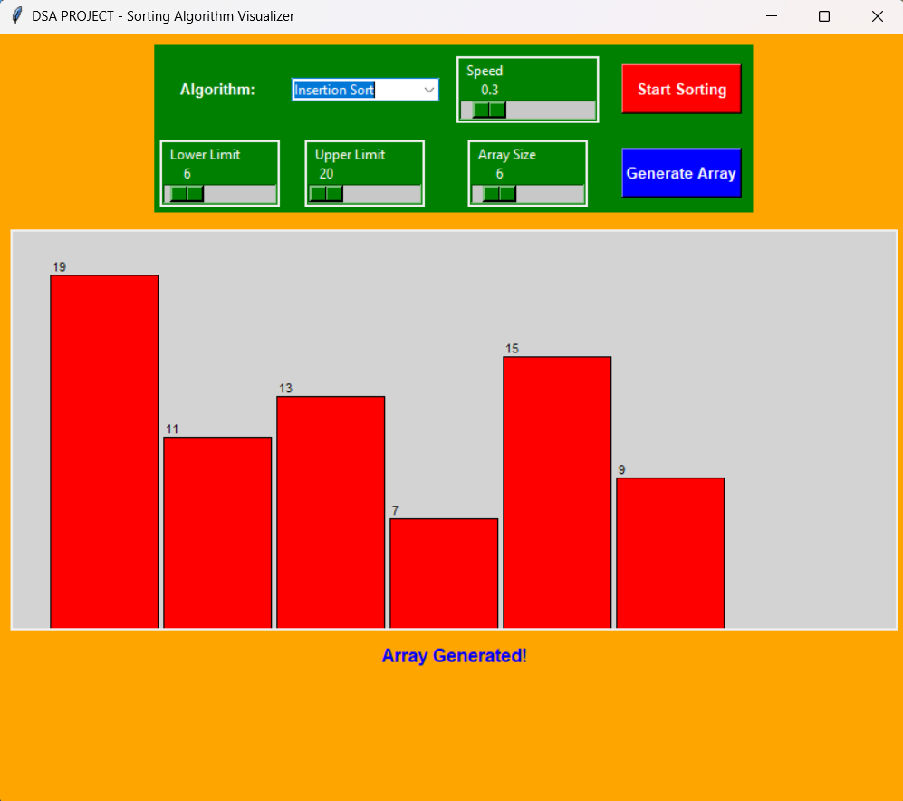
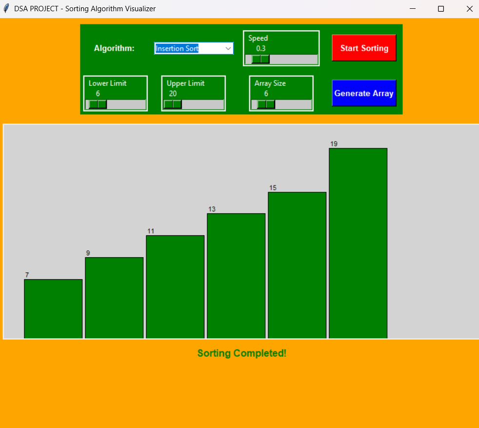

# Sorting Visualizer 🎨📊

A Python-based GUI project that visually demonstrates sorting algorithms like Bubble Sort, Selection Sort, Insertion Sort, Counting Sort, Merge Sort, Heap Sort etc.

## 🔧 Technologies Used
- Python
- Tkinter
- Sorting Algorithms(DSA)

## 🚀 How to Run
1. Clone the repository: https://github.com/harsh076gupta/sorting-visualizer.git
2. Navigate into the folder: cd sorting-visualizer
3. Run the script: python main.py

## 📸 Screenshots

### Bubble Sort Visualization  

### Insertion Sort Visualization 

